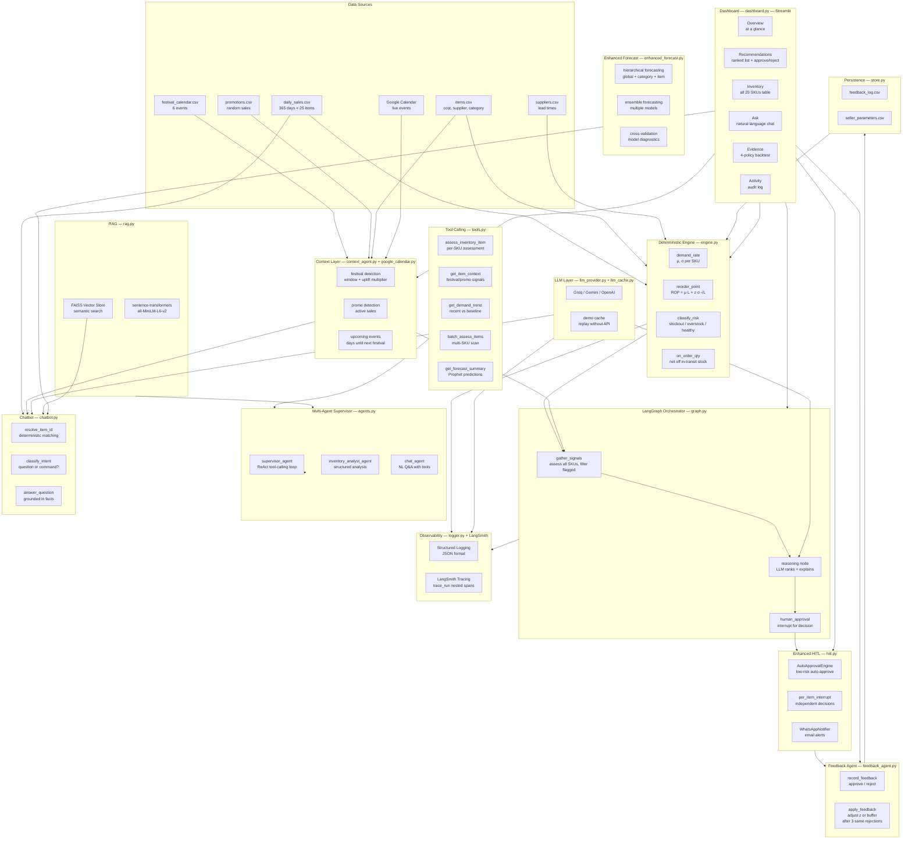
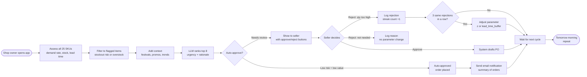
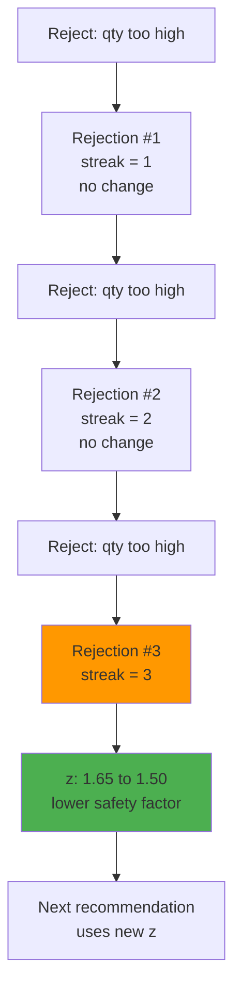
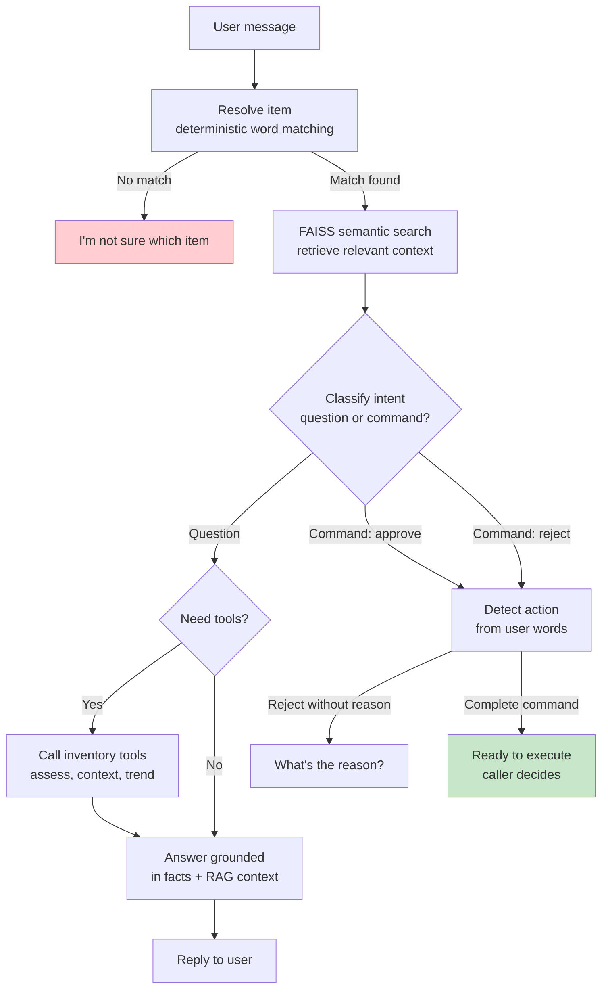
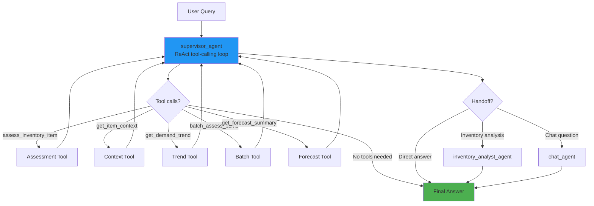

# SellerSense — Autonomous Inventory Reordering Platform

### [Live Demo](https://autonomous-inventory-management-reordering-platform-mx4aqvegc3.streamlit.app/)

---

## The Problem

A small shop owner with **25 items** reorders every morning based on gut feeling.

| What goes wrong | How it costs money |
|---|---|
| Runs out of fast-selling items | Lost sales — customer walks away |
| Overorders slow-moving items | Cash stuck on shelves for months |
| Misses festival demand spikes | Loses 40% of Diwali sales |
| No time to do the math daily | Nobody checks reorder points by hand |

The math (reorder point formula) has existed since 1913. **Nobody uses it because gathering inputs daily is the hard part, not the formula.**

---

## What SellerSense Does

**An AI assistant that watches your shop and tells you what to order, how much, and why.**

```
You: "What do I need to order today?"

SellerSense: 
  1. Rice 5kg — Order 23 units (running low, 2.5 days left)
  2. Biscuits Pack — Order 80 units (Diwali in 10 days, demand spikes)
  3. Umbrella — 24 units arriving tomorrow (already on order)
```

---

## How It Works

### System Architecture (Enhanced with Agentic AI)



### Daily Flow — What Happens Each Morning



### Feedback Learning Loop



### Chatbot Flow (Enhanced with RAG + Tools)



### Multi-Agent Architecture



---

## Dashboard — 6 Tabs

| Tab | What It Shows |
|---|---|
| **Overview** | How many items need attention, cost to restock, top 3 actions, upcoming festivals |
| **Recommendations** | Ranked list with urgency + rationale, approve/reject buttons |
| **Inventory** | Full table of all 25 SKUs with risk status, stock levels, reorder points |
| **Ask** | Natural language chat — ask questions or give commands |
| **Evidence** | Backtest results: 4 ordering policies compared over 45 days |
| **Activity** | Audit log of every approve/reject decision and parameter change |

---

## Key Design Rule

> **The LLM never computes numbers. Python does all the math. The LLM only ranks, explains, and classifies.**

| What Python handles | What the LLM handles |
|---|---|
| Demand rate (μ, σ) | "This is urgent because..." |
| Reorder point calculation | Ranking items by urgency |
| Risk classification | Classifying user intent (question vs command) |
| Festival/promo detection | Writing plain-language rationales |
| In-transit stock netting | Answering natural language questions |
| Auto-approval decisions | Tool calling orchestration |

This boundary ensures:
- Numbers are always correct (deterministic functions)
- The LLM's text is checked for 3 classes of hallucination before display
- A model outage degrades gracefully to computed fallbacks

---

## Results — Does It Work?

45-day holdout backtest, all 25 SKUs:

| Policy | Stockout Days | Fill Rate | Capital Tied Up |
|---|---|---|---|
| Seller's own rule | 150 | 82.8% | ₹63,672 |
| **SellerSense** | **171** | **80.2%** | **₹30,837** |
| Plain reorder point | 302 | 64.3% | ₹20,235 |

**SellerSense reaches 97% of the seller's fill rate at 48% of the working capital.**

The shop owner frees ₹33,000 in cash for just 2.5% fill rate — a trade most would take.

---

## Tech Stack

| Layer | Technology |
|---|---|
| Frontend | Streamlit |
| Orchestration | LangGraph |
| LLM | Groq (llama-3.3-70b), Gemini, OpenAI, or Ollama |
| Forecasting | Prophet (hierarchical + ensemble) |
| Vector Store | FAISS + sentence-transformers |
| Data | Pandas, NumPy |
| Observability | LangSmith + Structured Logging |
| Notifications | Twilio (WhatsApp + Email) |
| Testing | 186 tests (pytest) |
| Hosting | Streamlit Community Cloud |

---

## Local Setup

```bash
# Clone
git clone https://github.com/pavanjarpula/Autonomous-Inventory-Management-Reordering-Platform.git
cd Autonomous-Inventory-Management-Reordering-Platform

# Install
pip install -r requirements.txt

# Run dashboard
streamlit run src/dashboard.py

# Run tests
pytest

# Run backtest
python src/run_backtest.py
```

### Environment Variables (Optional)

```bash
# LLM Provider
export SELLERSENSE_LLM_PROVIDER=groq
export GROQ_API_KEY=your_key_here

# LangSmith Observability (free tier)
export LANGCHAIN_TRACING_V2=true
export LANGCHAIN_API_KEY=your_langsmith_key
export LANGCHAIN_PROJECT=sellersense

# Twilio Notifications (optional)
export TWILIO_ACCOUNT_SID=your_sid
export TWILIO_AUTH_TOKEN=your_token
export TWILIO_WHATSAPP_FROM=+1234567890
export TWILIO_EMAIL_FROM=your_email@twilio.email
```

---

## Project Structure

```
├── src/
│   ├── engine.py              # Deterministic inventory math
│   ├── context_agent.py       # Festival + promo context
│   ├── forecast.py            # Prophet models + backtest
│   ├── enhanced_forecast.py   # Hierarchical + ensemble forecasting
│   ├── graph.py               # LangGraph orchestrator
│   ├── feedback_agent.py      # Learning from seller decisions
│   ├── chatbot.py             # Natural language interface
│   ├── dashboard.py           # Streamlit UI (6 tabs)
│   ├── llm_provider.py        # Multi-provider LLM support
│   ├── llm_cache.py           # Demo-safety caching
│   ├── store.py               # CSV persistence
│   ├── tools.py               # @tool-decorated functions (Phase 2)
│   ├── agents.py              # Multi-agent supervisor (Phase 2)
│   ├── rag.py                 # FAISS vector store + RAG (Phase 3)
│   ├── google_calendar.py     # Google Calendar integration (Phase 4)
│   ├── hitl.py                # Auto-approval + notifications (Phase 5)
│   ├── logger.py              # Structured JSON logging (Phase 1)
│   ├── tracing.py             # LangSmith nested trace helper
│   └── run_backtest.py        # Backtest runner
├── tests/                     # 186 tests
│   ├── test_engine.py
│   ├── test_context_agent.py
│   ├── test_forecast.py
│   ├── test_graph.py
│   ├── test_feedback_agent.py
│   ├── test_chatbot.py
│   ├── test_llm_cache.py
│   ├── test_llm_provider.py
│   ├── test_store.py
│   ├── test_tools_agents.py   # Tool + agent tests (Phase 2)
│   ├── test_rag.py            # RAG tests (Phase 3)
│   ├── test_google_calendar.py # Calendar tests (Phase 4)
│   ├── test_hitl.py           # HITL tests (Phase 5)
│   └── test_enhanced_forecast.py # Enhanced forecast tests (Phase 6)
├── data/
│   ├── items.csv              # 25 SKUs
│   ├── suppliers.csv          # 5 suppliers
│   ├── daily_sales.csv        # 365 days of sales
│   ├── festival_calendar.csv  # 6 festivals
│   ├── promotions.csv         # Random promos
│   ├── purchase_orders.csv    # In-transit stock
│   ├── festival_item_overrides.csv
│   ├── generate_dataset.py    # Dataset generator
│   └── backtest_results.csv   # 4-policy comparison
└── requirements.txt
```

---

## Implementation Phases

| Phase | Description | Status |
|-------|-------------|--------|
| 1 | LangSmith nested tracing (trace_run) + structured logging | ✅ Complete |
| 2 | Tool calling with @tool decorators + multi-agent supervisor | ✅ Complete |
| 3 | FAISS vector store + RAG-enhanced chatbot | ✅ Complete |
| 4 | Google Calendar integration for dynamic festival detection | ✅ Complete |
| 5 | Enhanced HITL - per-item interrupts + auto-approval + Email | ✅ Complete |
| 6 | Prophet enhancement - hierarchical priors + external regressors | ✅ Complete |

---

## License

MIT
